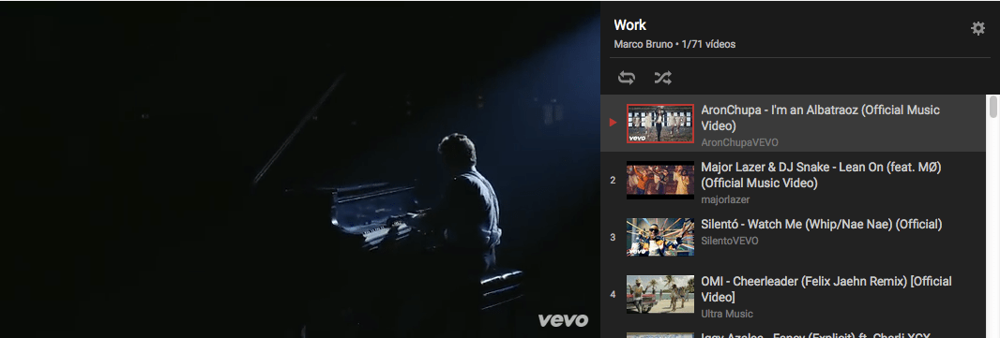
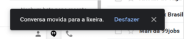
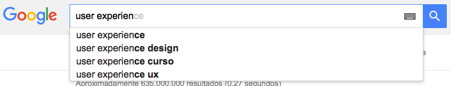
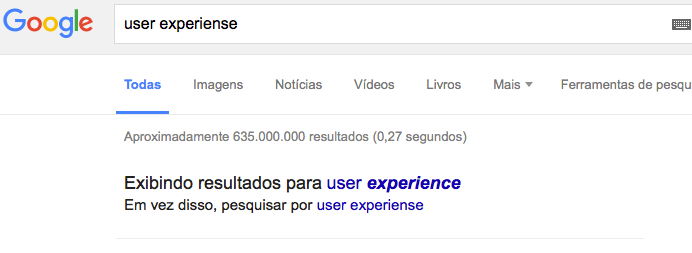
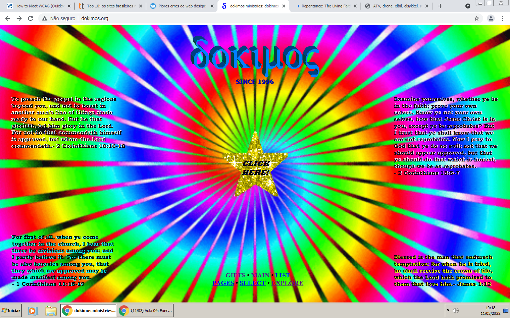
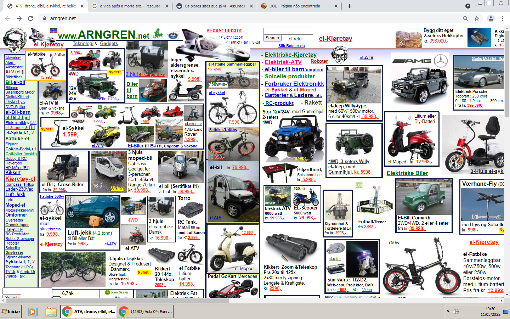

# Heurísticas de Nielsen e WCAG

## Exemplos de acertos

**1. Visibilidade do status do sistema**

O sistema deve mostrar o que está acontecendo em tempo real pro usuário, um exemplo disso é a interface das playlists Youtube, que ficam ao lado direito do vídeo, mostrando qual vídeo da lista estamos assistindo, qual os próximos e quais já foram assistidos

**3. Controle e liberdade para o usuário**

O sistema deve permitir que o usuário tenha liberdade para realizar ações que ele deseja, mas em caso de acionar alguma ação por engano, deve haver um modo de desfazer (sair de uma janela indesejada ou retornar a um ponto anterior). Um exemplo é a ação de “desfazer” do Google quando a ação é exclusão de um e-mail.

**5. Prevenções de erros**

Melhor que deixar o usuário resolver um erro é evitar que ele cometa erros, um exemplo disso é a busca do Google, que enquanto estamos digitando na barra de pesquisa ele apresenta algumas sugestões mas também corrigindo erros de ortografia caso tenhamos pesquisado algo errado.

|                         Realizando uma busca no Google                          |                                                     Resultado da busca com erro de ortográfica                                                      |
| :-----------------------------------------------------------------------------: | :-------------------------------------------------------------------------------------------------------------------------------------------------: |
|  |  |

---

## Exemplos de erros

**Exemplo 1**

> **Observações:** muitas cores misturadas, não colaborando para uma harmonia visual; texto ilegível por conta do baixo contraste entre o background e a cor do texto, além de não utilizar uma fonte simples e de fácil legibilidade; elementos piscando e se mexendo em todos os cantos da tela, podendo representar certo risco de convulsão

**Exemplo 2**

> **Observações:** pode causar confusão ao usuário por não facilitar a identificação de sua localização no site nem as ações permitidas claramente; não é minimalista, pelo contrário, utiliza exageradamente de informações e elementos na tela, causando cansaço mental ao interagir com o site e não estabelecendo harmonia visual; não há a presença de padrões, não há familiaridade do usuário com as funcionalidades disponíveis
